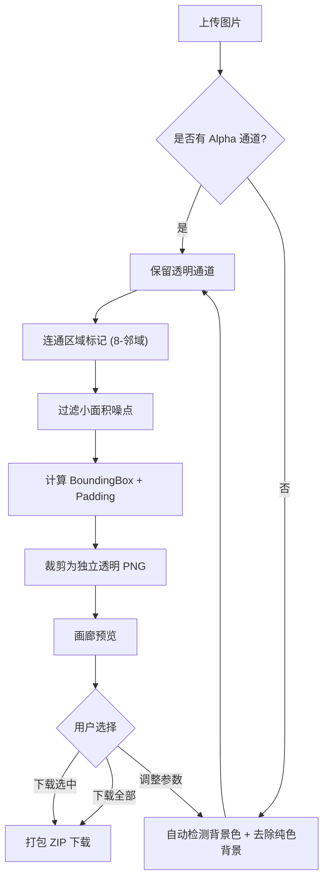

## 1. 产品概述

一个纯前端的智能图片元素拆分工具，可自动识别并去除纯色背景（或保留已有的透明背景），通过连通区域检测算法将图中每个独立的图片元素切割出来，分别输出为透明 PNG。

- 解决问题：设计师/电商运营在处理素材图、贴纸图、精灵图（Sprite Sheet）时，需要手工抠图并逐个切分元素，效率极低
- 目标用户：UI 设计师、电商运营、游戏美术、自媒体创作者
- 价值：一键完成「去背景 + 元素拆分 + 批量导出」全流程，全部在浏览器本地处理，无需上传服务器，保护隐私

## 2. 核心功能

### 2.1 功能模块

1. **工作台主页**：上传区、参数面板、原图预览、元素画廊、批量操作栏

### 2.2 页面详情

| 页面名称 | 模块名称 | 功能描述 |
|----------|----------|----------|
| 工作台 | 上传区 | 支持拖拽 / 点击上传 PNG、JPG、WEBP，单张或多张 |
| 工作台 | 背景处理参数 | 自动检测纯色背景；可手动吸取背景色；容差滑块；边缘抗锯齿开关；最小元素尺寸 |
| 工作台 | 原图预览 | 显示原图，叠加透明棋盘格背景，可切换显示去背景后的效果 |
| 工作台 | 元素画廊 | 网格展示每个识别出的独立元素，含缩略图、序号、尺寸、 bounding box；单击可放大查看；支持多选 |
| 工作台 | 批量操作栏 | 「全选 / 反选」「下载选中」「下载全部」「清空」；始终可见，未选中时下载按钮置灰 |
| 工作台 | 导出设置 | 输出格式（PNG）；外扩 padding；按尺寸过滤；文件命名规则 |

## 3. 核心流程

用户上传图片 → 系统自动检测是否含 alpha 通道：
- 若已透明：直接进入元素拆分
- 若不透明：识别四角主色作为背景色，按容差将背景像素 alpha 置 0，再做边缘羽化/抗锯齿
→ 对 alpha 通道执行 8 邻域连通区域标记（Connected-Component Labeling）
→ 过滤面积小于阈值的噪点区域
→ 为每个连通区域计算 bounding box，按 padding 外扩后裁剪出独立元素
→ 渲染到画廊，用户预览/选择后打包下载（ZIP）

## 4. 用户界面设计

### 4.1 设计风格

- **风格定位**：现代专业工具风（类 Figma / Photoshop 工具栏的精致感），暗色主基调 + 单一锐利强调色（青柠绿 #C6F432 或电光蓝 #5EEAD4），避免紫色渐变 AI 感
- **主色**：背景 `#0E0F13`，面板 `#16181F`，边框 `#262932`，前景文字 `#E6E8EC`，次级文字 `#8A8F9C`
- **强调色**：`#C6F432`（用于主按钮、选中态、进度条）
- **字体**：标题用 `Space Grotesk` 的替代选择 `Geist` 或 `IBM Plex Sans`；正文 `Inter Tight`；代码/数据用 `JetBrains Mono`
- **按钮样式**：主按钮填充强调色 + 黑色文字；次按钮边框 + 透明背景；圆角 8px；hover 时微妙位移与发光
- **布局**：左侧参数面板（固定 320px），中央原图预览，右侧元素画廊（可滚动）；顶部为工具栏与状态信息
- **图标**：使用 `lucide-react` 线性图标，1.5px 描边
- **动效**：上传时进度环、元素卡片 stagger fade-in、悬停轻微 lift + 边框高亮、画廊滚动惯性

### 4.2 页面设计概览

| 页面名称 | 模块名称 | UI 元素 |
|----------|----------|----------|
| 工作台 | 顶部工具栏 | Logo、当前文件名、处理状态徽标、重新上传按钮 |
| 工作台 | 左侧参数面板 | 背景模式选择（自动/吸取/手动输入色值）、容差滑块、抗锯齿开关、最小元素尺寸滑块、padding 滑块、重新处理按钮 |
| 工作台 | 中央预览区 | 棋盘格透明背景画布、原图/处理结果切换 Tab、缩放控制、坐标显示 |
| 工作台 | 右侧画廊 | 元素网格卡片（缩略图 + 序号 + 尺寸 badge）、多选 checkbox、空状态插画 |
| 工作台 | 底部批量操作栏 | 元素计数、「全选 \| 反选」「下载选中」「下载全部」「清空」按钮组（始终可见，未选中时下载选中置灰） |

### 4.3 响应式

- 桌面优先设计（≥1280px 三栏布局）
- 中等屏幕（1024-1280px）：参数面板折叠为抽屉
- 移动端（<1024px）：单栏堆叠，画廊改为横向滑动

### 4.4 关键交互

- 拖拽上传时全屏遮罩 + 虚线边框高亮
- 处理中显示进度（按连通区域数量进度条）
- 关闭/刷新页面时若有未下载元素，弹出确认对话框（FloatingWindow 风格，非 alert）
- 清空操作前需二次确认
- 吸取背景色时光标变为十字准星，悬停像素显示色值
