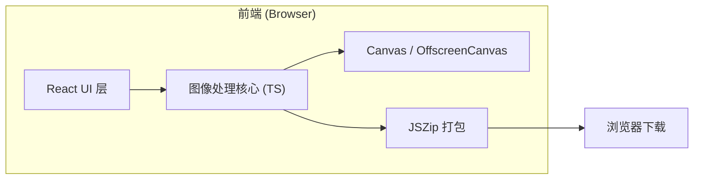

## 1. 架构设计

纯前端架构，所有图像处理在浏览器内通过 Canvas API 完成，无后端服务、无文件上传，确保隐私与速度。



## 2. 技术说明

- **前端**：React 18 + TypeScript + Vite 5
- **样式**：Tailwind CSS 3 + CSS Variables 主题
- **图标**：lucide-react
- **图像处理**：原生 Canvas 2D API + 自实现连通区域标记算法
- **打包下载**：JSZip + FileSaver
- **拖拽上传**：react-dropzone
- **初始化工具**：`npm create vite@latest . -- --template react-ts`

## 3. 路由定义

单页应用，无需路由。所有功能在工作台单一视图完成。

## 4. 核心算法

### 4.1 背景色检测与去除

```
1. 将图片绘制到 Canvas，获取 ImageData
2. 取四角像素颜色，投票确定主背景色 bgColor
3. 遍历像素，若与 bgColor 的 RGB 距离 < 容差，则 alpha = 0
4. (可选) 对 alpha 边缘做 1px 羽化，减少锯齿
```

### 4.2 连通区域标记（8-邻域 BFS）

```
1. 创建 visited 数组，大小 = width * height
2. 对每个 alpha > 0 且未访问的像素，启动 BFS
3. BFS 中收集所有连通像素，记录 min/max x/y
4. 标记完成后得到区域列表 [{ pixels, bbox }]
5. 过滤 pixels.length < minSize 的区域
6. 对每个 bbox 按 padding 外扩并裁剪到新 Canvas
7. 新 Canvas 通过 toBlob('image/png') 输出
```

### 4.3 性能优化

- 使用 Uint8ClampedArray 直接操作像素
- BFS 使用迭代而非递归（避免栈溢出）
- 大图（>4000px）先缩放到 2000px 长边处理
- Web Worker 中执行连通区域分析（避免阻塞主线程）

## 5. 目录结构

```
src/
├── components/
│   ├── Uploader.tsx          # 上传组件
│   ├── ParameterPanel.tsx    # 左侧参数面板
│   ├── PreviewCanvas.tsx     # 中央预览
│   ├── ElementGallery.tsx    # 右侧画廊
│   ├── BatchActionBar.tsx    # 底部批量操作栏
│   └── ConfirmDialog.tsx     # 确认对话框
├── lib/
│   ├── backgroundRemoval.ts  # 背景去除
│   ├── connectedComponents.ts # 连通区域标记
│   ├── imageUtils.ts         # 图像工具
│   └── download.ts           # 打包下载
├── hooks/
│   └── useImageProcessor.ts  # 处理流程 hook
├── types/
│   └── index.ts
├── App.tsx
└── main.tsx
```

## 6. 数据模型

### 6.1 核心类型

```typescript
interface ProcessOptions {
  bgMode: 'auto' | 'picker' | 'transparent';
  bgColor?: { r: number; g: number; b: number };
  tolerance: number;        // 0-100
  antiAlias: boolean;
  minElementSize: number;   // 像素数
  padding: number;          // 像素
}

interface DetectedElement {
  id: string;
  index: number;
  blob: Blob;
  width: number;
  height: number;
  bbox: { x: number; y: number; w: number; h: number };
  selected: boolean;
}
```
